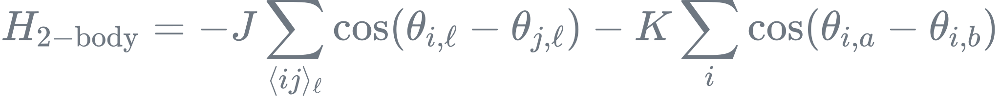
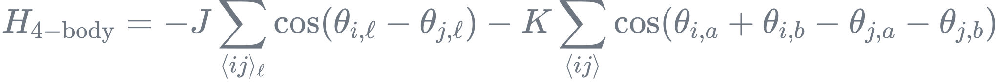

# Bilayer XY Model

This Monte Carlo simulation program contains two implementations for studying bilayer XY models with different coupling mechanisms. These models are important for understanding phase transitions in layered spin systems.

The first implementation simulates the two-body coupling bilayer XY model with Hamiltonian:
<div align="center">
  
</div>
where $\ell = a, b$ represents layer a and layer b. We set temperature as 1 and tune the parameters $J$ and $K$ to explore the phase diagram.

The second implementation focuses on four-body interactions between layers, with Hamiltonian:
<div align="center">
  
</div>

## How to use

1. Clone the repository:
    ```bash
    git clone https://github.com/Tensofermi/Bilayer_XY_Model
    cd Bilayer_XY_Model
    ```

2. Configure model selection in `Makefile`:
    ```bash
    SRC_DIR := src_2_body
    # SRC_DIR := src_4_body
    ```
    Uncomment the desired model and comment the other.

3.  Set parameters in `input.txt` and run the simulation:
    ```
    ./run.sh
    ```

4. For advanced simulations, including job submissions on HPC systems, refer to the `/lsub`, `/qsub` and `/data` directories in our related project:  [Zoo_of_Classical_ON_Spin_Model.](https://github.com/Tensofermi/Zoo_of_Classical_ON_Spin_Model)


## Physics Results
Our simulations measure single-layer correlations and paired correlations to distinguish different phases in these models:

__Two-Body Model__

- Two distinct phases identified: disorder phase and BKT phase
- Critical exponent $\eta$ at BKT transition points matches theoretical predictions
- Strong agreement between numerical and analytical results

__Four-Body Model__

- Three-phase structure discovered: disorder phase, paired BKT phase, and conventional BKT phase
- Novel paired BKT phase exists as an intermediate state between disordered and conventional BKT phases
- Non-trivial behavior observed at phase boundaries

These findings are thoroughly documented in our paper: [arXiv:2504.01461](https://arxiv.org/abs/2504.01461).

## Citation
If you use this code or refer to our results in your research, please cite:
``` TEXT
@article{xiao2025fate,
  title={Fate of Berezinskii-Kosterlitz-Thouless Paired Phase in Coupled $ XY $ Models},
  author={Xiao, Tianning and Deng, Youjin and Dong, Xiao-Yu},
  journal={arXiv preprint arXiv:2504.01461},
  year={2025}
}
```